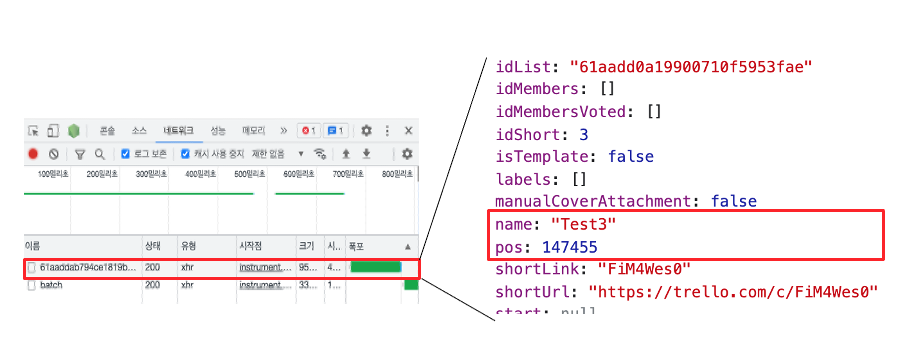
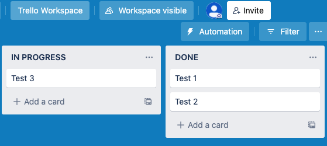
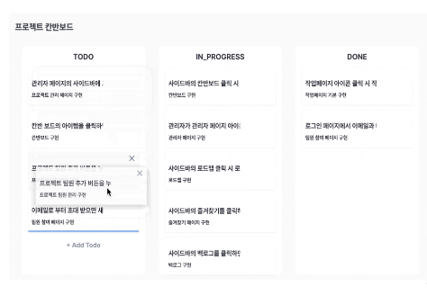

### TL;DR

- 칸반보드에서는 스토리 아이템을 관리할 수 있다.
- 트렐로의 네트워크 탭을 참고해 최소한의 상태를 변화시켰다.
- 아이템 이동 시 드랍될 영역에 대한 인식이 어려운 문제가 있었고, 파란색 영역을 표시하는 기능을 추가해 UX 를 개선했다.

## 스토리를 관리하는 칸반보드

칸반보드에서는 스토리 아이템을 관리할 수 있다. 칸반 보드에서 각각의 아이템은 하나 스토리를 나타내며, TODO, IN_PROGRESS, DONE 3가지 Status 값을 가진다. 라이브러리 없이 드래그 앤 드랍을 구현하고, 실시간으로 상태 변화가 동기화하도록 기능을 구현해야했다.

먼저 Story 테이블에 순서를 나타내는 Order 를 추가했다.

```ts
@Entity({ name: 'STORIES' })
export default class Stories {
  @PrimaryGeneratedColumn({ name: 'ID' })
  id!: number;

  @Column('decimal', { name: 'ORDER', precision: 20, scale: 12 })
  order!: number;
```

순서를 보장하기 위해서 처음에는 링크드 리스트로 구현했다. 하지만 이 경우에는 아이템의 순서를 변경할 때마다, 적어도 4개 이상의 상태의 변경이 필요했다. 실시간 상태가 동기화를 고려해보면 4번의 요청은 비효율적이였다. 또한 불필요한 상태 변화가 빈번하다면 사용자 입장에서 동기화된 상태 유지를 보장할 수 없었다. 따라서 요청의 개수를 줄일 수 있는 방법에 대해 고민하고, 기존의 잘 만들어진 트렐로 서비스를 분석했다.

## 트렐로 서비스 네트워크 탭 분석하기

트렐로는 웹에서의 칸반보드 기능을 잘 구현한 서비스 중 하나이다.
처음에는 노션의 칸반 보드 기능을 분석하려고 했지만, 노션은 웹에서의 기능을 분석하기가 번거로워서 트렐로를 선택했다. 트렐로의 칸반에서 아이템을 생성하고 하나씩 이동시키면서 네트워크 탭을 분석했다.

<div align="center">

</div>

<br>

다음은 트렐로 네트워크 탭에서 Test3 아이템을 이동시킬 때 발생하는 요청에 대한 스크린샷이다. batch 라는 요청과 해쉬값으로 추정되는 이름의 요청을 보내고 있었다. batch 는 아마 지속적으로 데이터를 일괄적으로 처리하고 상태를 유지하기 위한 요청인 것 같았다. 그리고 해쉬 값에 해당하는 요청에서 힌트를 얻을 수 있었다. POS 라는 프로퍼티를 통해 아이템의 순서를 보장하고 있었다.

<br>

<div align="center">

</div>

<br>
Test 1 과 Test 2 의 POS 를 각각 0과 10으로 가정하고(트렐로에서는 6자리의 정수로 유지하고 있었다.), Test3 를 Test1 과 Test2 사이로 이동시켰다. 그리고 Test3 의
POS 값을 0과 10의 중간 값인 5로 바뀌었다. 이 방식을 통해 트렐로는 변경되는 아이템에 대해서만 상태를 변경시키는 요청을 보내고 있었다. 고민했던 문제를 해결해줄 것이라고 생각하고 코드를 작성했다.

## 노션의 UX 를 참고해서 UX 개선하기

기능 구현을 마무리하고, 사용자 입장에서 드랍될 영역에 대한 파악이 어렵다고 생각했다. 어떻게 문제를 해결할지 고민하다가 노션의 칸반 보드에서 제공하는 기능을 참고해 문제 해결의 실마리를 얻을 수 있었다. 노션에서는 아이템이 드랍될 영역에 대해서 파란색 보조선을 나타내어, 사용자가 예측할 수 있도록 해주었다.

<div align="center">

</div>

이 기능을 구현하기 위해서 DragAndDrop API 의 DragEnter 이벤트를 활용했다. 사용자가 아이템을 선택하고, 끌어서 아이템 위를 이동할 때마다 마우스 밑에 있는 아이템은 이 이벤트를 감지한다. 그리고 본인의 border-bottom 에 애니메이션을 통해 굵은 파란색 선이 나타나도록 했다. 이를 통해 사용자는 동작에 대한 예측이 쉬워지고, 좋은 UX 를 경험할 것이라고 생각했다.

## 마무리

상태 변화의 빈도를 낮추고, 사용자 경험의 개선을 목적을 갖고 칸반 보드 기능을 완성할 수 있었다. 기존의 서비스를 분석하면서 기능 구현을 예측해보고, 적용하는 즐거움을 느낄 수 있었다. 또한 UX 개선을 시도해보고, 네트워킹 데이 때 좋은 평가를 얻을 수 있었다. 이 경험을 통해 UX 를 고민하고, 해결하는 과정도 FE 개발자에게 정말 중요할 수 있겠다는 생각을 했다.

칸반 보드에 대한 기능을 구현하면서 완성도 있는 기능 구현의 어려움 또한 느낄 수 있었다. 사소한 기능들도 사용자가 어떻게 사용할지를 고려하고 적용하는 과정이 필요했다. 기획 당시에 작성했던 백로그에서 구현에 대한 기능을 모두 포함하지는 못했다. 이는 스크럼을 통해서 기능 추가에 대한 이슈를 공유했다. 적극적인 이슈 공유와 문제를 함께 공유하고 고민하는 과정을 거치면서 기능을 잘 마무리할 수 있었던 것 같다. 어떤 이슈를 맞딱드리든 문제가 왜 문제인지 고민하고, 가능한 해결 방법에는 무엇이 있고, 우리의 상황에서는 어떻게 해결하는게 좋을지 함께 고민할 수 있었던 경험의 중요성을 알게 되었다.
